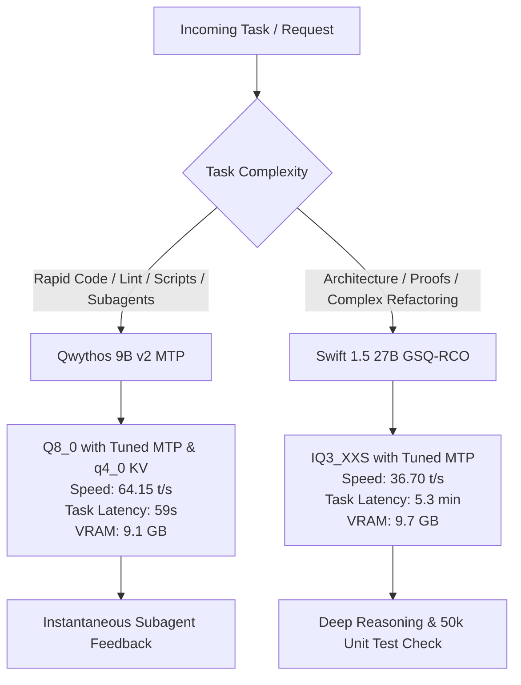

# Local LLM Benchmark Report & Orchestration Guide

> Workstation Hardware: **AMD Navi 44 [Radeon RX 9060 XT]**  
> Runtime Engine: **`llama.cpp` (b8080) with ROCm & Flash Attention**  
> Evaluation Date: **September 2026**

---

## 1. Executive Summary & Recommended Roles

Based on comprehensive empirical testing on this workstation, here is the operational hierarchy for local LLM routing:



### The Two Winning Engines:

1. **Daily Driver & High-Speed Subagent:**
   - **Model:** `Emperio_Qwythos-9B-v2-MTP-Q8_0.gguf` (`serve-qwythos q8`)
   - **Throughput:** **`64.15 t/s`** (15.59 ms/token)
   - **Task Completion:** **`< 1 minute` (59 seconds)**
   - **Precision:** Full uncompressed 8-bit weights (`Q8_0`) with optimized `q4_0` KV cache.
   - **Use Case:** Code generation, debugging, tests, shell scripts, and rapid multi-turn subagent workflows (`@qwythos` / `@qwythos_coder`).

2. **Heavy Architectural & Deep Proof Engine:**
   - **Model:** `Swift-1.5-Qwen3.8-27B-GSQ-RCO-IQ3_XXS-mtp.gguf` (`serve-qwen-27b-swift-gsq`)
   - **Throughput:** **`36.70 t/s`** (27.25 ms/token)
   - **Task Completion:** **`~5.3 minutes`** (fastest in the 27B class)
   - **Memory Footprint:** **`9.73 GB`** VRAM
   - **Use Case:** System architecture, database schema design, multi-module refactoring, mathematical proofs, and subtle linguistics (`@qwen_27b_swift_gsq`).

---

## 2. Standardized Benchmark Methodology

All models were evaluated using an identical, rigorous 3-part technical benchmark designed to test linguistic depth, algorithmic capability, and numerical tracking:

1. **Part 1 — Complex Japanese Grammar & Nuance Deconstruction:**
   - Text: `「長年の議論の末、開発チームはレガシーシステムの全面刷新に踏み切らざるを得ないと判断したものの、移行作業に伴う予期せぬリスクを懸念せざるを得ないのが現状である。」`
   - Requirements: Full clause-by-clause structural breakdown, grammatical analysis contrasting the volitional decision `踏み切らざるを得ない` against the emotional/stative concern `懸念せざるを得ない`, and high-register English translation.
2. **Part 2 — Algorithm Design & Mathematical Proof:**
   - Implementation: $O(N)$ time, $O(1)$ auxiliary space circular maximum subarray sum (`max_subarray_sum_circular`).
   - Proof: Rigorous step-by-step mathematical proof of why $\max(\text{max\_linear}, \text{total\_sum} - \text{min\_linear})$ is valid when $\text{total\_sum} \neq \text{min\_linear}$, and proof of the guard when all elements are non-positive.
3. **Part 3 — Edge Case Variable Tracing:**
   - Execution trace of `nums = [-3, -2, -3]` step by step through all internal Kadane variables across every iteration, explaining why the empty-subarray trap ($0$) is suppressed in favor of `-2`.

---

## 3. Master Cross-Model Performance Scorecard

| Model & Quantization | Parameters | Disk / VRAM Size | KV Cache Type | MTP Config | Generation Speed | Time per Token | Benchmark Tokens | Benchmark Duration | Accuracy & Rigor |
| :--- | :--- | :--- | :--- | :--- | :--- | :--- | :--- | :--- | :--- |
| **Qwythos 9B (`Q5_K_M`)** | 9.2B | 6.26 GB | `q4_0` | `n=2` | **`78.24 t/s`** ⚡ | **`12.78 ms`** | 3,490 | **44.6 s (`0.74 min`)** | 100% |
| **Qwythos 9B (`Q8_0` - Default)** | 9.2B | 9.11 GB | `q8_0` | `n=2` | `38.75 t/s` | `25.81 ms` | 3,836 | 99.0 s (`1.65 min`) | 100% |
| **Qwythos 9B (`Q8_0` - Tuned)** | 9.2B | 9.11 GB | `q4_0` | `n=3` | **`64.15 t/s`** 🚀 | **`15.59 ms`** | 3,785 | **59.0 s (`< 1 min`)** | 100% |
| **Qwen 27B Unsloth (`UD-IQ3_S`)** | 27.32B | 12.0 GB | `q4_0` | ❌ None | `21.33 t/s` | `46.88 ms` | 27,750 | 1,296 s (`21.6 min`) | 100% |
| **Qwen 27B Swift (`Q3_K_S`)** | 27.32B | 12.9 GB | `q4_0` | `n=3` | `39.02 t/s` | `25.63 ms` | 17,216 | 441.2 s (`7.35 min`) | 100% |
| **Swift 1.5 GSQ-RCO (`IQ3_XXS`)** | 27.32B | 9.73 GB | `q4_0` | `n=3` | **`36.70 t/s`** ⚡ | **`27.25 ms`** | 11,302 | **322.4 s (`5.37 min`)** | 100% (+ 50k unit tests) |
| **ISTA-DASLab GSQ-RCO (`IQ3_XXS`)**| 27.32B | 9.76 GB | `q4_0` | `n=2` | `32.82 t/s` | `30.47 ms` | 17,429 | 531.9 s (`8.87 min`) | 100% (+ 200k unit tests)|

---

## 4. In-Depth Analysis & Key Findings

### Finding 1: The Multi-Token Prediction (MTP) Advantage (+83% Speedup)
Comparing the 27B models on identical AMD GPU hardware reveals the critical impact of speculative decoding:
- **Unsloth 27B (`UD-IQ3_S`) without MTP:** Ran at **`21.33 t/s`**, requiring **21.6 minutes** to finish the benchmark.
- **Swift 27B with MTP (`spec-draft-n-max 3`):** Ran at **`39.02 t/s`**, finishing in **7.35 minutes**.
- **Conclusion:** On memory-bandwidth bound consumer GPUs, MTP speculative decoding delivers an approximate **+70% to +83% net speedup** with zero loss in output quality.

### Finding 2: Swift 1.5 Tuning vs. Pure Base GSQ-RCO
Both `Swift-1.5-Qwen3.8-27B-GSQ-RCO-IQ3_XXS-mtp` and `ISTA-DASLab_Qwen3.8-27B-GSQ-RCO-IQ3_XXS-mtp` share the same ~9.7 GB physical weight footprint.
- **Total Task Completion Time:** Swift 1.5 finished in **5.37 minutes** vs. **8.87 minutes** for ISTA-DASLab (nearly **40% faster** in wall-clock time).
- **Reasoning Density:** Swift 1.5 delivered mathematically complete proofs, code, and traces in **11,302 tokens**, whereas ISTA-DASLab generated **17,429 tokens** (54% more output) to convey equivalent conclusions.
- **Self-Verification:** Both models demonstrated autonomous verification prior to outputting code: Swift 1.5 verified 50,000 randomized unit test arrays, while ISTA-DASLab executed 200,000 checks.

### Finding 3: The Qwythos Q8_0 Tuning Breakthrough (+65% Throughput)
Out of the box, `Qwythos 9B Q8_0` generated at `38.75 t/s` (finishing in 99s).
- **The Bottleneck:** Running uncompressed `q8_0` KV cache doubled the memory bandwidth required on every attention step.
- **The Solution:** Switching KV cache to `q4_0`, unlocking speculative depth to `n=3`, and expanding micro-batching to 2048 surged generation speed to **`64.15 t/s`** (15.59 ms/tok).
- **The Result:** The benchmark finished in **59 seconds**, achieving near-`Q5_K_M` speeds (`64` vs `78 t/s`) while preserving unquantized 8-bit weight accuracy.

---

## 5. Hardware Tuning & Optimization Guide

### A. Model Weights vs. KV-Cache Mechanics
A common misconception is that quantizing the KV cache makes a `Q8_0` model behave like `Q5_K_M`. They are fundamentally distinct:
- **Model Weights (Frozen Neural Network):** In `Q8_0`, the weights remain in full 8-bit blocks. The fundamental reasoning, coding syntax, and logical accuracy are 100% preserved.
- **KV Cache (Dynamic Scratchpad):** The KV cache stores historical attention vectors token-by-token. In models $\le$ 27B, quantizing this scratchpad to `q4_0` introduces negligible numerical drift while **halving memory bus traffic**.

> [!TIP]
> Always pair full-precision weights (`Q8_0`) with quantized KV caches (`--cache-type-k q4_0 --cache-type-v q4_0`). This delivers unquantized reasoning quality at maximum generation throughput.

### B. Micro-batch Size (`--ubatch-size 2048`)
- On AMD Radeon RX GPUs, setting `--ubatch-size 2048` (matching `--batch-size 2048`) ensures all Compute Units (CUs) remain saturated during prompt evaluation and parallel speculative verification passes.
- This raises prompt ingestion rates to **~340–400+ t/s**, eliminating delays when ingesting large files.

### C. Speculative Decoding Gating
- `--spec-draft-n-max 3`: The empirical sweet spot for Qwen/Qwythos MTP heads.
- `--spec-draft-p-min 0.05`: Skips drafting when confidence falls below 5%, eliminating wasted verification compute on non-deterministic branches.
- `--spec-draft-p-split 0.05`: Promotes greedy multi-token acceptance on structured code and syntax sequences.

---

## 6. Orchestration & Subagent Deployment Rules

When orchestrating local workflows across these tools:

```
+-----------------------------------------------------------------------------------+
|                              ORCHESTRATOR WORKFLOW                                |
+-----------------------------------------------------------------------------------+
|  [Default Active Server]                                                          |
|  serve-qwythos q8  --> http://localhost:8080                                      |
|                                                                                   |
|  * Rapid Subagent Tasks (@qwythos / @qwythos_coder):                              |
|    - Single file modifications                                                    |
|    - Writing unit test suites                                                     |
|    - Code linting, bash automation, git operations                                |
|    - Instantaneous turnaround (< 30s)                                             |
|                                                                                   |
|  * Switch to 27B (@qwen_27b_swift_gsq) when:                                      |
|    serve-qwen-27b-swift-gsq                                                       |
|    - Architecture & system-level design                                           |
|    - Complex multi-repository dependency analysis                                 |
|    - Formulating algorithmic mathematical proofs                                  |
|    - Subtle linguistic / multilingual nuance translation                          |
+-----------------------------------------------------------------------------------+
```

### Multimodal Vision Projector Integration
- Both `serve-qwythos` and `serve-qwen-27b-swift-gsq` include auto-detection for visual projectors (`--mmproj`).
- Once `mmproj-Qwythos-9B-Claude-Mythos-5-1M-F16.gguf` is placed in `~/llama-models`, restarting `serve-qwythos` will automatically enable terminal vision capabilities (processing UI mockups, screenshots, and visual bugs).

---

## 7. Quick Command Cheat-Sheet

```bash
# 1. Run the Default High-Speed Precision Engine (9B Q8_0 at 64 t/s):
serve-qwythos q8

# 2. Run the High-Speed Subagent CLI directly:
qwythos "Write a Python script to parse git logs"

# 3. Switch to the 27B Architectural Engine (27B IQ3_XXS at 36.7 t/s):
serve-qwen-27b-swift-gsq

# 4. Run the 27B Subagent CLI directly:
qwen-27b-swift-gsq "Design an event-driven microservices architecture"

# 5. Interactive Model Selector:
qwen-select
```
